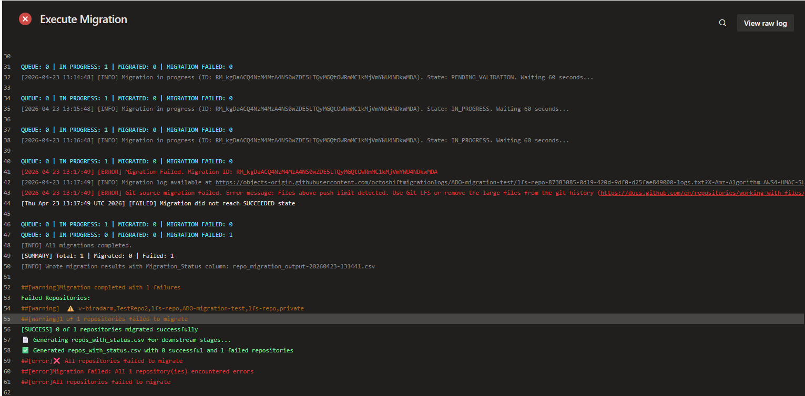
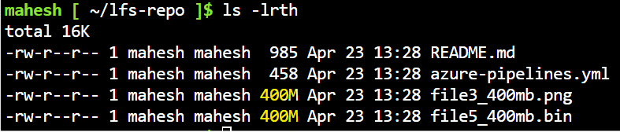
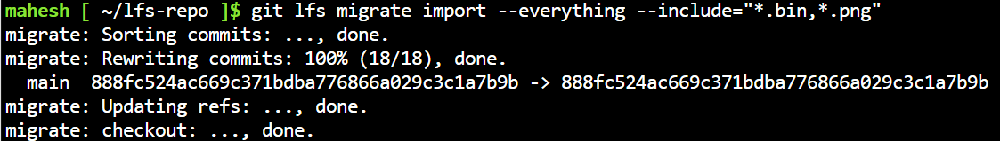
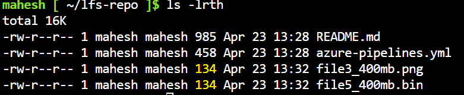
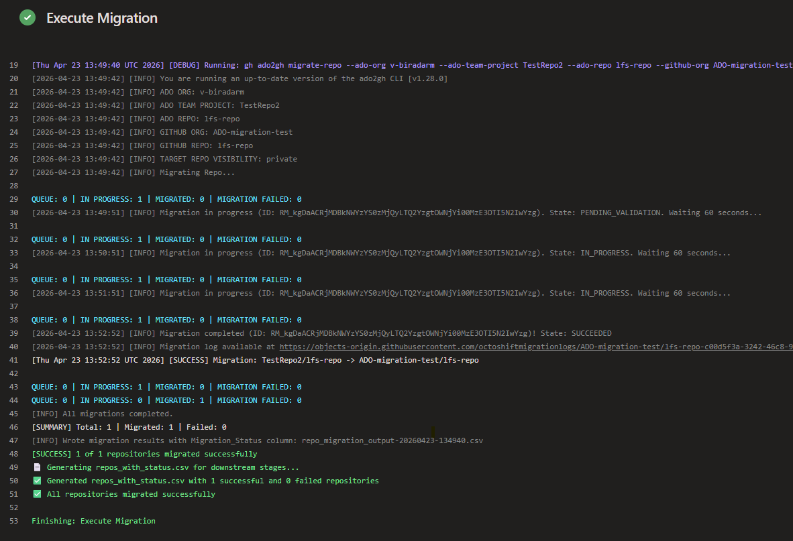

# ADO to GitHub Migration: Large File Process Guide
 ###### Important: Standard migration tools (GEI/ado2gh) will fail if the source repository contains files larger than 400MB within the Git history. Use this process to scrub history and bridge LFS data.

## The Problem: Migration Failure
GitHub enforces a strict 100MB limit for standard Git objects. If a file (e.g., file_400mb.bin) was ever committed normally, the migration will fail even if the file is currently small.
  
  ### Example error
  > [ERROR] Git source migration failed. Error message: Files above push limit detected. 
Use Git LFS or remove the large files from the git history.
Large files: [ { file_path: file2_400mb.bin, size: 419430400 bytes } ]
    


## Prerequisites
Developers must have Git LFS installed and initialized globally on their machines.
```bash
$ git lfs version
git-lfs/3.7.1 (GitHub; darwin arm64; go 1.25.3)
```
## Phase 1: Scrubbing ADO History
If the migration fails, you must "shrink" the history by converting old heavy blobs into LFS pointers.

### Step A: Clone the Repo
```bash
git clone <ADO_REPO_URL>
cd <REPO_NAME>
```

### step B: Identify large size
```bash
ls -lrth
```


### Step C: Migrate History to LFS
```bash
# Target specific extensions (e.g., .bin, .png)
git lfs migrate import --everything --include="*.bin,*.png"
```


### Step D: Verify History is Reduced
```bash
# Verify LFS is tracking the files
git lfs ls-files

# Verify local file size is now just the pointer size (~134 bytes)
ls -lrth
```


### Step E: Force Push back to ADO
Since history was rewritten, a force push is required to update Azure DevOps.
```bash
git lfs push origin --all
git push origin --force --all
```

## Phase 2: Perform Migration
Now, execute your standard ADO2GH Migration Script. Because the history now only contains small pointers, the migration will reach a SUCCEEDED state.


## Phase 3: Bridge the Data (Claiming Files)
The migration script moves the "receipts" (pointers) but not the "cargo" (the 800MB data). You must manually move the data from the Azure Vault to the GitHub Vault.

### Step A: Add Both Remotes
``` bash
git remote add azure <ADO_URL>
git remote add github <GITHUB_URL>
```

### Step B: Transfer the Binary Cargo
```bash
# Download data from Azure
git lfs fetch azure main

# Upload data to GitHub
git lfs push github --all
```

### Step C: Finalize Local Files
To swap the 134-byte pointers back into full 400MB usable files on your machine:
```bash
git lfs pull
```
